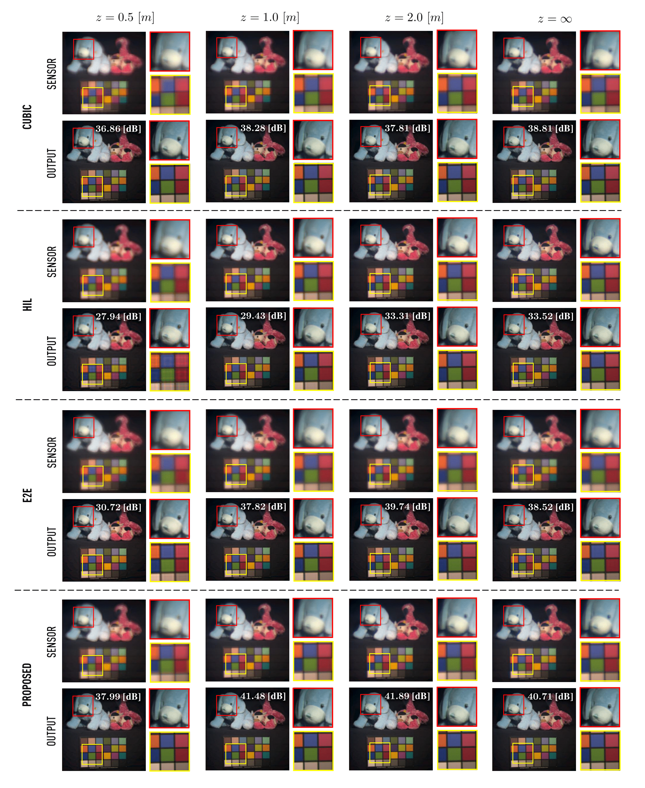

# Multispectral extended depth of field via stocastic wavefront optimization

Our repository simulates the light propagation through a diffractive optical element (DOE), whose modulated transfer function (MTF) is almost invariant to wavelength changes. The pipeline is as follows: the incoming incoherent light passes through a diffractive optical element (DOE). It is captured by a multispectral sensor, such as, pushbroom, or a multispectral filter array (MSFA) or a single snapshot compressive spectral imager (CASSI). We introduce a novel wavefront coding approach that leverages stochastic wavefront optimization.

For our simulation we use the CAVE Dataset:

https://cave.cs.columbia.edu/repository/Multispectral

To run our simulator use:

main_multispectral.m

If you use this code, please consider citing our paper with the following Bibtex code:

```
@ARTICLE{11106763,
  author={Oliva, Exequiel and Díaz, Nelson and Pinilla, Samuel and Vera, Esteban},
  journal={IEEE Open Journal of Signal Processing}, 
  title={Multispectral Extended Depth-of-Field Imaging via Stochastic Wavefront Optimization}, 
  year={2025},
  volume={6},
  number={},
  pages={965-974},
  keywords={Optimization;Imaging;Optical imaging;Optical diffraction;Optical sensors;Optical refraction;Optical filters;Apertures;Signal processing algorithms;Polynomials;Diffractive optical element;extended depth-of-field;multispectral imaging;stochastic optimization;wavefront coding},
  doi={10.1109/OJSP.2025.3595046}}
```

The published version is available at this [link](https://ieeexplore.ieee.org/document/11106763)


## Abstract

Extended depth-of-field (EDoF) is a desirable attribute for imaging systems where all features in the scene are in focus despite their relative distance. Traditional imaging systems can achieve EDoF by reducing the aperture size at the expense of signal-to-noise ratio, particularly relevant in spectral imaging systems where incoming light is further divided. By designing and integrating diffractive optical elements (DOEs) placed at the aperture plane of the imaging system, wavefront coding has enabled EDoF while maintaining a larger aperture size at the expense of post-processing. Nevertheless, chromatic aberrations may appear and can often be confused by defocus, jeopardizing the fidelity of the reconstructions. This work presents a novel design approach for a multispectral-aware DOE for EDoF. By considering and modeling a refractive-diffractive optical setup, our proposed system uses the stochastic optimization framework to optimize DOE patterns to preserve spectral fidelity while extending the depth-of-field simultaneously. The optimization process exploits the covariance matrix adaptation evolution strategy (CMA-ES), efficiently exploring complex, high-dimensional phase configurations without the need for explicit gradient information. The optimized DOE is constantly evaluated in a simulated imaging pipeline where the EDoF multispectral datacube is deblurred using Richardson-Lucy deconvolution. Both qualitative and quantitative results demonstrate that the proposed DOE significantly improves depth invariance and spectral fidelity of the reconstructed datacubes compared to conventional and state-of-the-art DOE designs, making it a cost-effective solution for real-world multispectral EDoF applications.


<br/>
